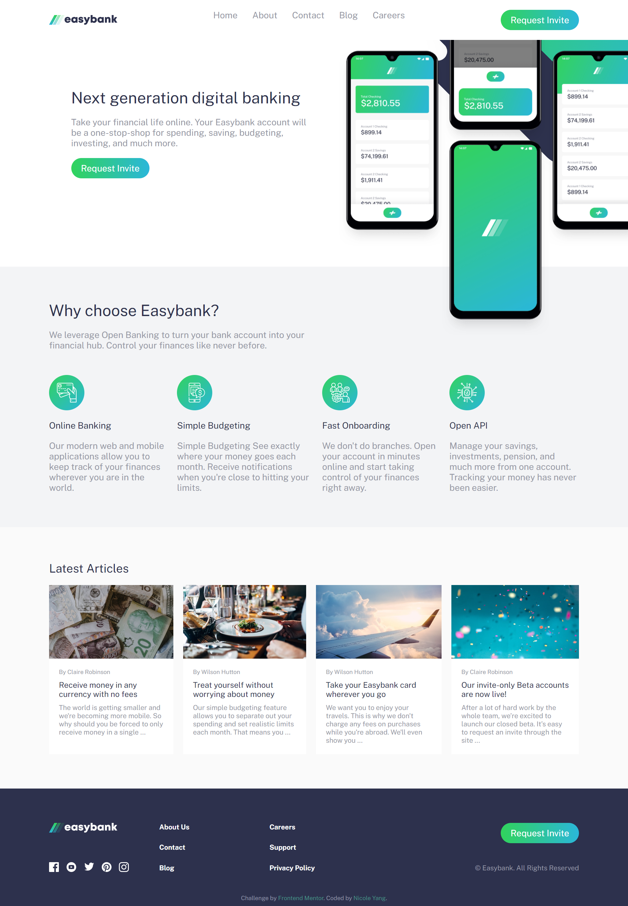

# Frontend Mentor - Easybank landing page solution

This is a solution to the [Easybank landing page challenge on Frontend Mentor](https://www.frontendmentor.io/challenges/easybank-landing-page-WaUhkoDN). Frontend Mentor challenges help you improve your coding skills by building realistic projects. 

## Table of contents

- [Overview](#overview)
  - [The challenge](#the-challenge)
  - [Screenshot](#screenshot)
  - [Links](#links)
- [My process](#my-process)
  - [Built with](#built-with)
- [Author](#author)

## Overview

### The challenge

Users should be able to:

- View the optimal layout for the site depending on their device's screen size
- See hover states for all interactive elements on the page

### Screenshot

### Links

- Solution URL: [https://www.frontendmentor.io/solutions/responsive-landing-page-using-css-flex-grid-sass-1jrtjtv_iy](https://www.frontendmentor.io/solutions/responsive-landing-page-using-css-flex-grid-sass-1jrtjtv_iy)
- Live Site URL: [https://nicoleyry.github.io/easybank-landing-page/](https://nicoleyry.github.io/easybank-landing-page/)

## My process

### Built with

- Semantic HTML5 markup
- CSS custom properties
- Flexbox
- CSS Grid
- Mobile-first workflow
- [SASS](https://sass-lang.com/) - For styles

## Author

- Website - [Nicole Yang](https://www.nicoleyry.com/)
- Frontend Mentor - [@nicoleyry](https://www.frontendmentor.io/profile/nicoleyry)
- Twitter - [@nicoleyry](https://twitter.com/nicoleyry)